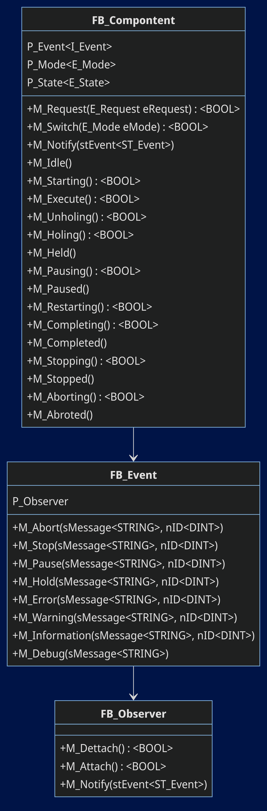

# Tc3_Component
A library for TwinCAT 3 (4026) which is using design patterns to standardize machine control software.\
The goal are to code reliable Software in a short time,\
have a lightweight and modular Framework.

## Info
The concept is working quite stable.\
Project is still under heavy development, and without any warranty!\
There is still a lot of work to do, if somebody have ideas, contributors are welcome!

## State Machine (FB_Component MTP)

## Class (FB_Component)

## Description
    [x] State Machine
    [x] Command Pattern to change component states
    [x] Observer Pattern to Notify state changes
    [x] Eventlogger
    [x] Sequence Manager
    [x] Module to handle Components

[#####-----]

## Code 
